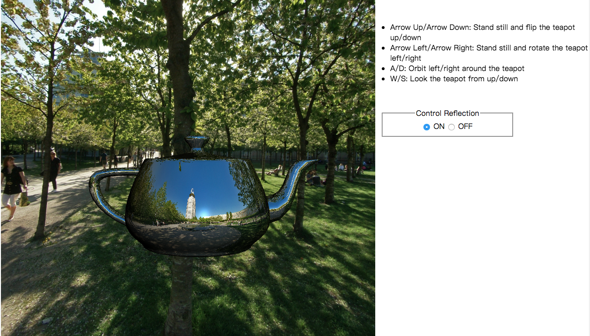
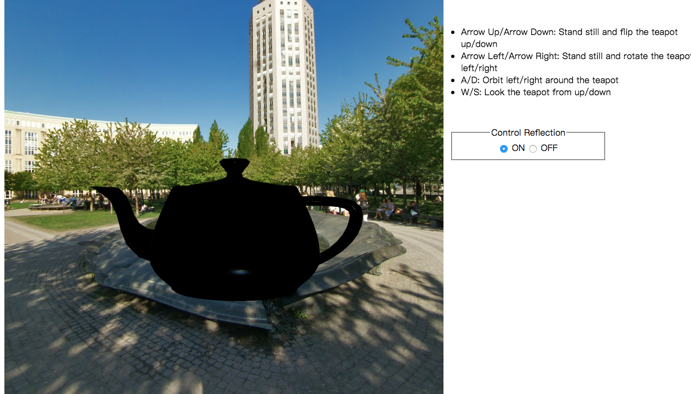
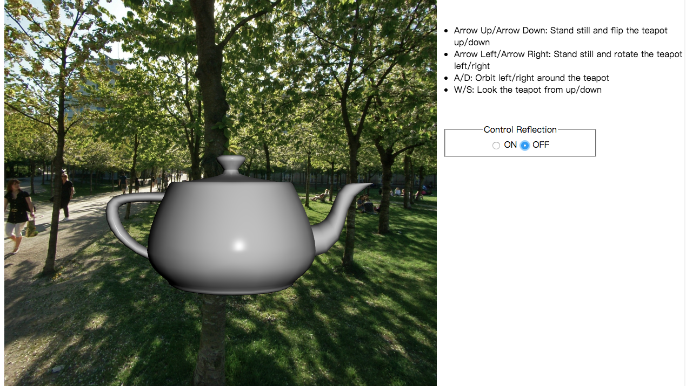

## Title
Environment Mapping For A Teapot

## Modeling
(1) Teapot: Create a teapot from teapot.obj file.  
(2) Skybox: Create a skybox to simulate the environment.  

## Control The Teapot
The project will simulate 2 kinds of movements:  
(1) Assume all the objects in the scene is static, and the viewer/user moves around the teapot. 
(2) Assume the viewer/user stands still, and he/she rotates/flips the teapot.   

The project will provide 2 modes to control the teapot surface:  
(1) A Reflective surface which is a reflection of the surrounding environment. 
(2) A shading surface which uses the user-defined material color. 

## Lights
The position of light in the scene is also static, which means that when the viewer moves to the back of the teapot,  
he/she will just see a dark side without any illumination.  

## Instructions on How to Use the Program
Due to security reasons, some web browser prevent users reading local files including images.  
In order to read local image files,  
you can:  

1. If you use the Brackets editor, the live preview function will start up a server (and browser) to test your code. 
Just have Chrome open, and the open your html file in Brackets. Click the lightning bolt icon in the top right of the Brackets window.  

2. Alternatively, you can install node.js Then install and run httpserver to serve the directory that it is run from. 

3. This can also be done using Python. Run this command in your terminal in the directory you want to serve:  
(1) "python -m http.server 8000" (server number doesn't have to be 8000)  
(2) Then point your browser to "localhost:8000" 

## Images Preview

