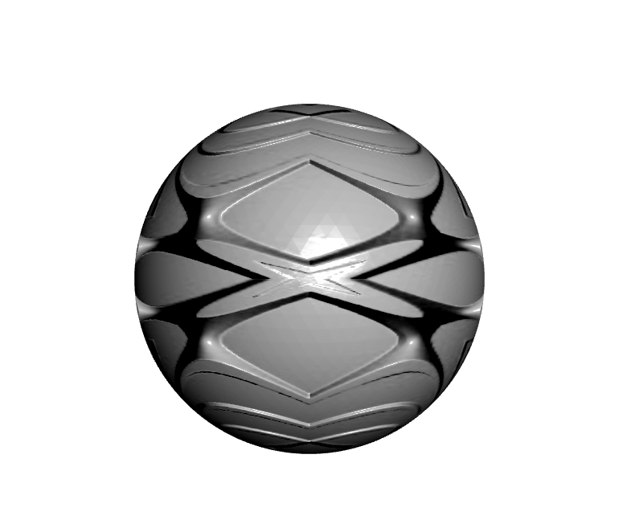

## Title
Nomal Mapping to Create A Magic Ball

## Modeling
(1) Generate a sphere by creating triangle meshes.  
(2) Use normal mapping image to render normal information to "change" the surface of the sphere.  

## Instructions on How to Use The Program:
Due to security reasons, some web browser prevent users reading local files including images.  
This project can successfully run in Firefox, but if you are using other browsers, in order to read local image files,  
you can:  

1. If you use the Brackets editor, the live preview function will start up a server (and browser) to test your code. 
Just have Chrome open, and the open your html file in Brackets. Click the lightning bolt icon in the top right of the Brackets window.  

2. Alternatively, you can install node.js Then install and run httpserver to serve the directory that it is run from. 

3. This can also be done using Python. Run this command in your terminal in the directory you want to serve:  
(1) "python -m http.server 8000" (server number doesn't have to be 8000)  
(2) Then point your browser to "localhost:8000" 

## Image Preview

## All Sources Used:
Normal Mapping tutorial: http://www.opengl-tutorial.org/intermediate-tutorials/tutorial-13-normal-mapping/

