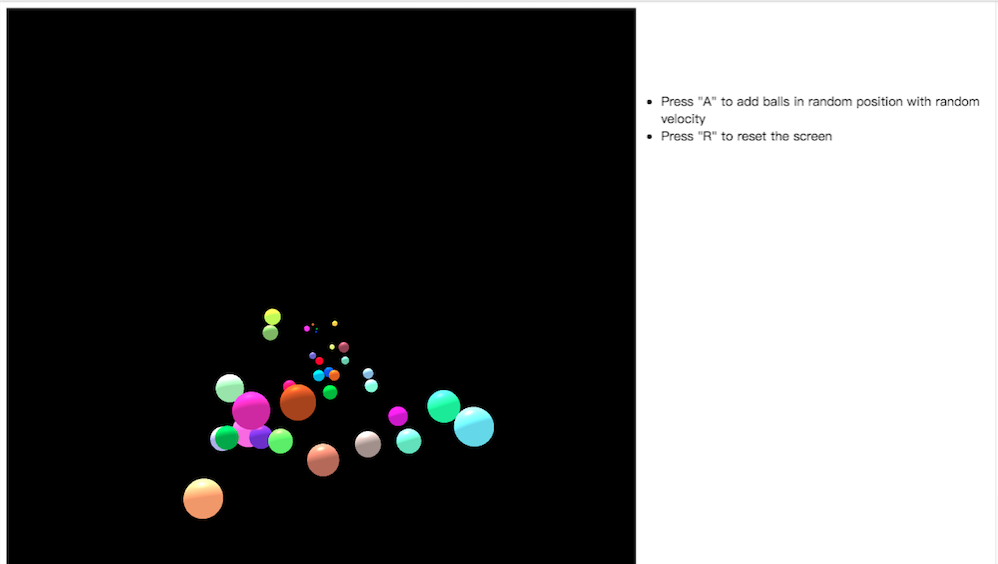

## Title
Simple Particle System: Bouncing Balls

## Modeling
(1) Balls: Use sphere model to generate balls with random colors and speeds.  
(2) Skybox: Use a cube to create a invisible skybox to simulate a room with 6 walls.  

## Particle System
This project will simulate the movements of balls after colliding on the walls.  

The balls are affected by 2 forces:  
(1) Gravity  
(2) Friction  

For the position of balls: 
(1) Update the position using the current velocity and Euler Integration.  
(2) Update the velocity using the two forces stated above. 

All the balls will be generated with a random color, position and velocity. 

## Instructions on How to Use The Program
Open the BouncingBalls.html in web browser and follow the user instructions. 

## Images Preview

